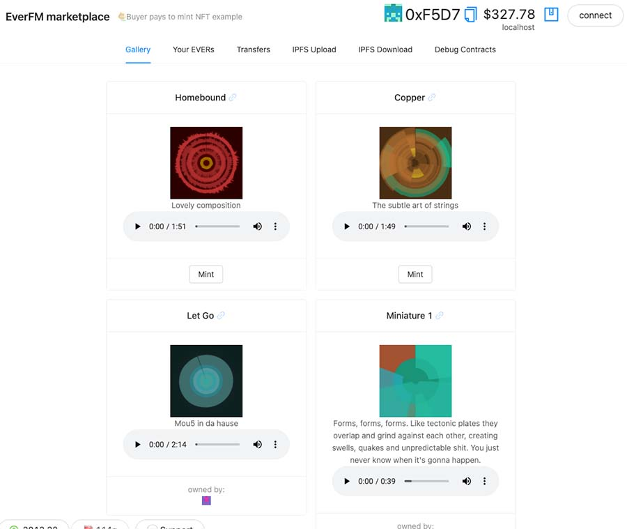

# 🏗 scaffold-eth - 🎲 VRF NFT 🎫

> Use VRF to get a 🎲 random "⚔️ strength" for each NFT as it is minted...

---

[](https://youtu.be/63sXEPIEh-k?t=1773)

---

## 🏃‍♀️ Quick Start

required: [Node](https://nodejs.org/dist/latest-v12.x/) plus [Yarn](https://classic.yarnpkg.com/en/docs/install/) and [Git](https://git-scm.com/downloads)


```bash
git clone https://github.com/Polygon-Academy/nftmarketexample

cd nftmarketexample
```

```bash

yarn install

```

```bash

yarn start

```

> in a second terminal window:

```bash
cd nftmarketexample
yarn chain

```

---

> ✏️ Edit the artwork manifest `artwork.js` with all of your art, then upload it to IPFS:

> in a third terminal window:


```bash
cd nftmarketexample

yarn upload

yarn deploy

```

📱 Open http://localhost:3000 to see the app

---

Your artwork from `artwork.json` (if uploaded and deployed correctly) should show a gallery of possible NFTS to mint:



💦 Use the faucet wallet icon in the bottom left of the frontend to give your address **$1000** in testnet ETH.

---


🎲 This repo uses Chainlink's VRF on Rinkby.

> First call `getRandomNumber()` from the `debug contracts` tab:


> Wait for the `randomResult` to get set:


> Finally, mint from the `gallery` tab and your NFT will have a `tokenStrength`:

